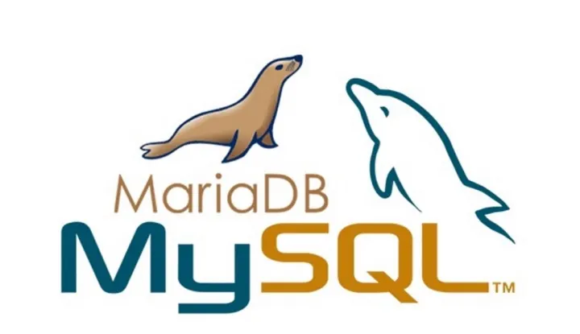

# Resumo: Licenças e Liberdades no Mundo Linux (Curso Linux #03)

Nesta aula, Gustavo Guanabara e Ricardo Pinheiro explicam a importância das licenças de software, focando especialmente nas liberdades que o software livre oferece e como as empresas conseguem lucrar com esse modelo.

## 📌 Informações Gerais
- **Canal:** [Curso em Vídeo](https://www.youtube.com/@cursoemvideo)
- **Apresentadores:** Gustavo Guanabara e Ricardo Pinheiro.
- **Link do Vídeo:** [Assista aqui](https://www.youtube.com/watch?v=-cR-0Ggi3B4)

---

## ⚖️ O que é uma Licença de Software?

Uma licença é um conjunto de regras que determina o que você pode ou não fazer com um produto intelectual (software, música, foto, etc.).
- **Software Proprietário (ex: Windows):** Você paga pelo direito de uso, mas não é dono do software e não pode ver como ele foi feito.
- **Creative Commons:** Licenças voltadas para mídia (fotos, vídeos, músicas), permitindo diferentes níveis de compartilhamento e uso.
- **Software Livre:** Focado na liberdade do usuário e não necessariamente na gratuidade.

---

## 🗽 As 4 Liberdades do Software Livre (GPL)

Para um software ser considerado livre (seguindo a licença GPL), ele deve garantir quatro liberdades fundamentais ao usuário:

1. **Liberdade 0 (Execução):** Liberdade de usar o programa para qualquer propósito.
2. **Liberdade 1 (Estudo):** Liberdade de estudar como o programa funciona e adaptá-lo às suas necessidades (acesso ao código-fonte).
3. **Liberdade 2 (Redistribuição):** Liberdade de distribuir cópias para ajudar outras pessoas.
4. **Liberdade 3 (Melhoria):** Liberdade de melhorar o programa e liberar suas melhorias para o público, para que toda a comunidade se beneficie.

---

## 💰 Como ganhar dinheiro com Software Livre?

Muita gente confunde "Livre" com "Grátis". No modelo de software livre, o lucro geralmente não vem da venda da licença, mas sim de:
- **Suporte Técnico:** Empresas pagam para ter especialistas disponíveis caso algo dê errado (ex: Red Hat, Canonical).
- **Serviços Agregados:** Treinamentos, consultoria e certificações profissionais.
- **Customização:** Desenvolvedores são pagos para adaptar o software livre às necessidades específicas de uma empresa.
- **Manuais e Mídias:** Antigamente, vendiam-se caixas com manuais impressos e CDs de instalação (ex: Conectiva Linux).

---

## 🐧 Curiosidades: Mascotes e Símbolos

O mundo do software livre é cheio de mascotes marcantes:
- **Tux (Pinguim):** O mascote oficial do Linux. A ideia veio de Linus Torvalds, que gosta de pinguins (há uma lenda de que ele foi bicado por um).  
 

- **Gnu:** O mascote do projeto GNU (uma espécie de antílope).  
  

- **Beastie (Diabinho):** O mascote do sistema BSD.  
 

- **Elefante:** Símbolo da linguagem PHP.  
  

- **Golfinho:** Símbolo do banco de dados MySQL/MariaDB.  

---

## 💡 Reflexão da Aula
"Livre como em liberdade de expressão, não como em cerveja de graça." O Linux dá ao usuário o controle total sobre sua máquina, permitindo que ele aprenda e evolua sem estar preso a contratos abusivos ou códigos fechados.

---