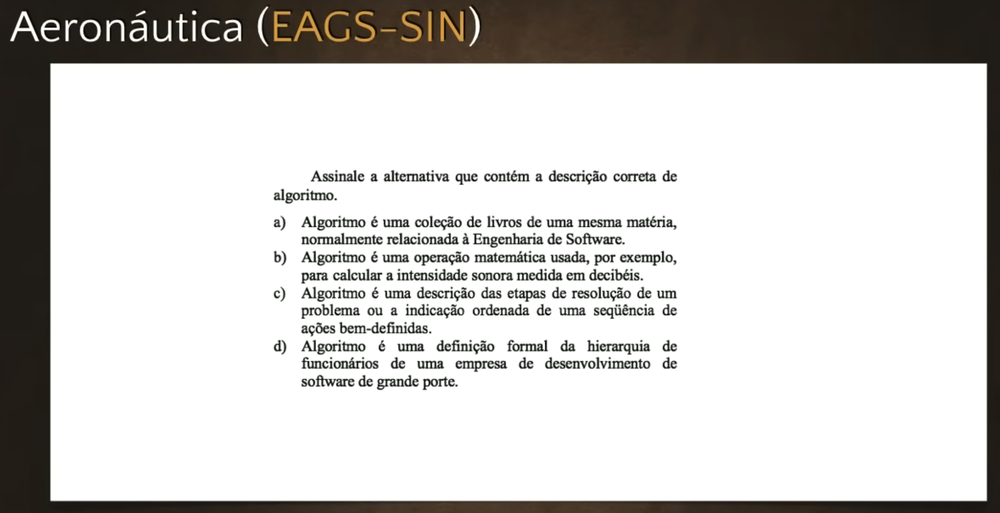
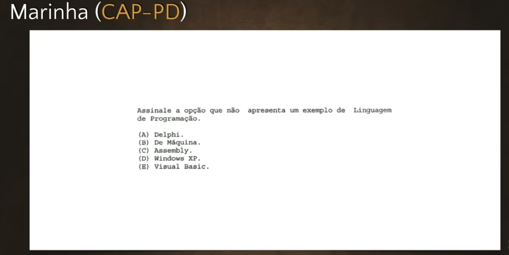
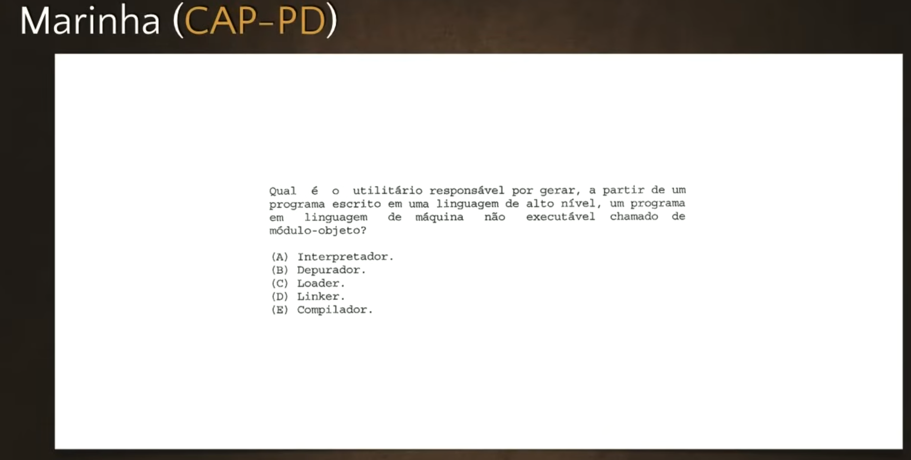
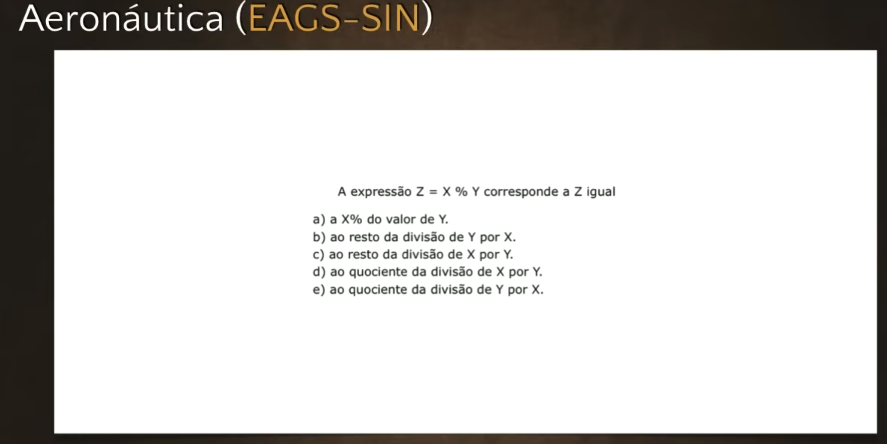
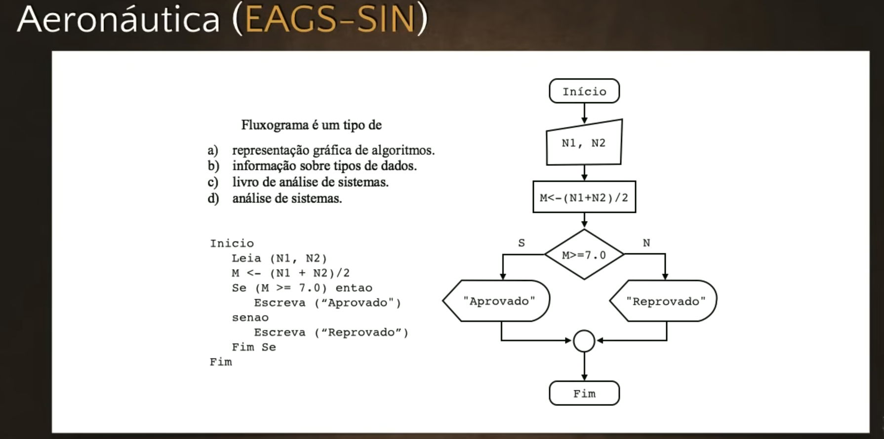
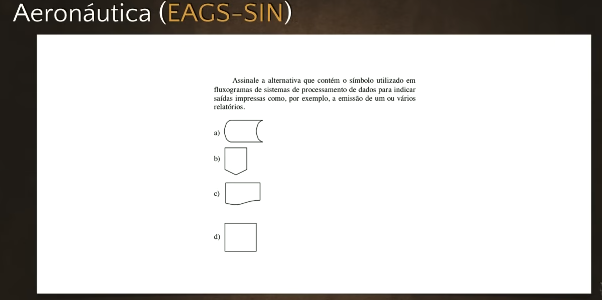
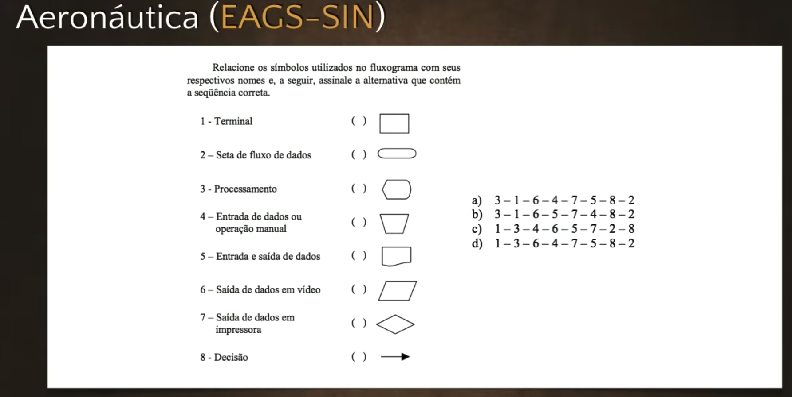

# Exercícios de Java #01 - Curso de Java para Iniciantes
**Professor:** Gustavo Guanabara | **Canal:** Curso em Vídeo

Este documento apresenta o resumo da primeira aula exclusiva de exercícios do Curso de Java. Como a primeira aula do curso foi fortemente teórica (abordando a história da linguagem), esta aula de exercícios foge um pouco do padrão de codificação prática e foca em uma revisão essencial de **Lógica de Programação e Algoritmos**.

Além disso, o professor destaca as oportunidades profissionais para jovens na área de tecnologia dentro das Forças Armadas Brasileiras.

## 1. Oportunidades nas Forças Armadas para Profissionais de TI
Antes de iniciar os exercícios, o professor traz uma informação relevante sobre carreiras públicas: o mito de que nas Forças Armadas só se entra pelo serviço militar obrigatório como recruta/soldado. 
Existem concursos públicos específicos para técnicos em informática (onde caem conteúdos como Algoritmo, PHP, Java, Redes):
*   **EAGS (Estágio de Adaptação à Graduação de Sargento da Aeronáutica):** Focado no Sistema de Informação (EAGS SIN). Ao ser aprovado, o profissional já ingressa trabalhando na área de tecnologia de informação com a patente de Sargento.
*   **CAP (Corpo Auxiliar de Praças da Marinha):** Focado em Processamento de Dados (CAP PD). Ao ser aprovado, o profissional ingressa como Cabo.

O foco dos exercícios dessa aula é exatamente resolver questões reais retiradas dessas provas militares, mostrando ao aluno que os conceitos ensinados no Curso em Vídeo capacitam para concursos desse nível.

## 2. Resolução de Questões de Concurso

### Questão 1 (Aeronáutica): O que é algoritmo?

**Pergunta:** Assinale a alternativa que contém a descrição correta de algoritmo.
*   **Análise:** Algoritmo não é uma coleção de livros, nem apenas uma operação matemática (embora as use), nem definição hierárquica de empresa.
*   **Resposta Certa:** Algoritmo é a descrição de etapas da resolução de um problema ou a indicação ordenada de uma sequência de ações bem definidas.

### Questão 2 (Concurso Militar): Linguagens de Programação

**Pergunta:** Assinale a opção que NÃO apresenta um exemplo de linguagem de programação.
*   **Opções:** Delphi (Object Pascal), Linguagem de Máquina (binário), Assembly (Linguagem montadora), Windows XP, Visual Basic.
*   **Análise:** Delphi, Máquina, Assembly e Visual Basic são formas de programar ou instruir a máquina. O Windows XP é um Sistema Operacional.
*   **Resposta Certa:** Windows XP.

### Questão 3 (Marinha): Processo de Compilação

**Pergunta:** Qual é o utilitário responsável por gerar, a partir de um programa escrito em linguagem de alto nível, um programa em linguagem de máquina não executável chamado de módulo objeto?
*   **Opções:** Interpretador, Depurador, Loader, Linker, Compilador.
*   **Análise:** O processo que pega o código-fonte (alto nível) e transforma em código objeto é a *compilação*. O processo de pegar o código objeto e gerar o executável é feito pelo *Linker*. Se a execução fosse direta do fonte para a máquina, seria o *Interpretador*.
*   **Resposta Certa:** Compilador.

### Questão 4: Operador de Resto (Módulo)

**Pergunta:** A expressão `Z = X % Y` corresponde a:
*   **Análise:** Na programação, o sinal de porcentagem `%` não calcula a porcentagem matemática de um número. Ele é o operador de *Módulo*, que retorna o resto de uma divisão inteira (ex: 5 dividido por 2 dá 2, e o resto é 1. Logo, `5 % 2 = 1`).
*   **Resposta Certa:** Resto da divisão de X por Y.

### Questão 5: Fluxogramas

O vídeo finaliza com três questões focadas em **Fluxogramas**, que são a representação gráfica de um algoritmo. Em vez de ler pseudo-código, o fluxo de execução e a tomada de decisão são mapeados através de formas geométricas específicas.

### Questão 6: Símbolo Utilizado em Fluxogramas de Sistemas de Processamento de Dados

*   **Resposta Certa:** C.

### Questão 7: Simbologia Principal de Fluxogramas

*   **Terminal (Início/Fim):** Forma ovalada (parece um biscoito maizena).
*   **Seta de Fluxo:** Seta indicando a direção dos dados.
*   **Entrada Manual (Teclado):** Um retângulo inclinado no topo.
*   **Processamento/Atribuição:** Retângulo simples.
*   **Decisão (Condicional SE/SENÃO):** Losango.
*   **Saída em Vídeo (Monitor):** Retângulo com o lado direito curvado e o esquerdo em bico (lembrando tubo de imagem antigo).
*   **Saída Impressa (Papel):** Retângulo com a base ondulada.

As três questões abordadas na prova pediam simplesmente para identificar a definição de fluxograma (representação gráfica), identificar o símbolo que representava a saída em folha impressa (relatórios) e fazer a correlação entre os nomes dos símbolos e seus respectivos desenhos, servindo como uma excelente revisão visual para lógicas estruturadas que serão traduzidas para Java nas próximas aulas.

---

## Desempenho

**Meus Acertos:** `[ 5 / 7 ]`