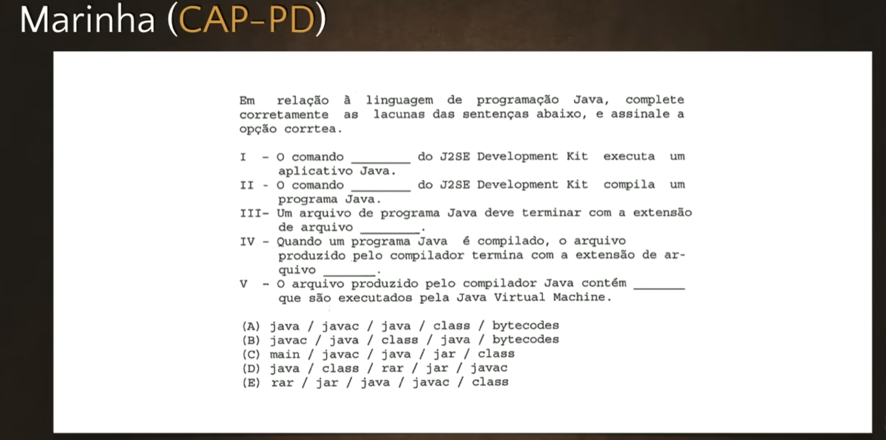
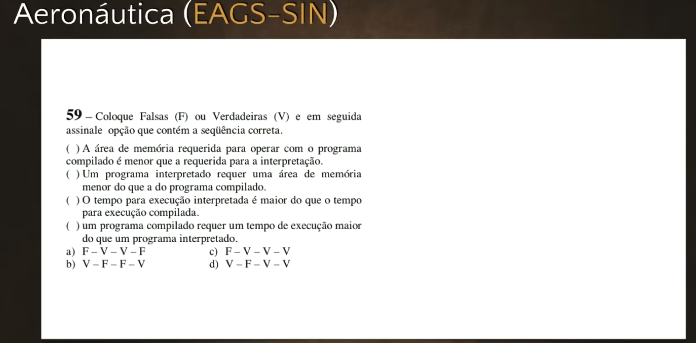
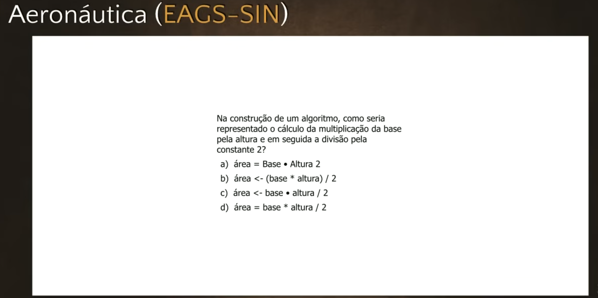
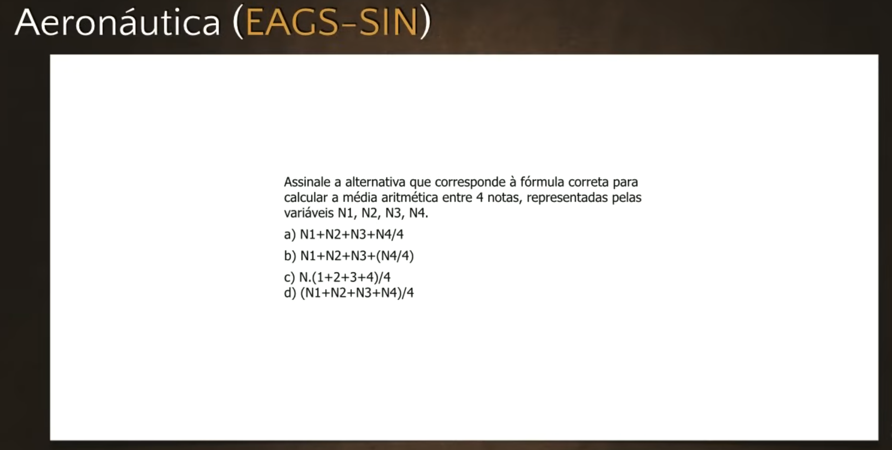
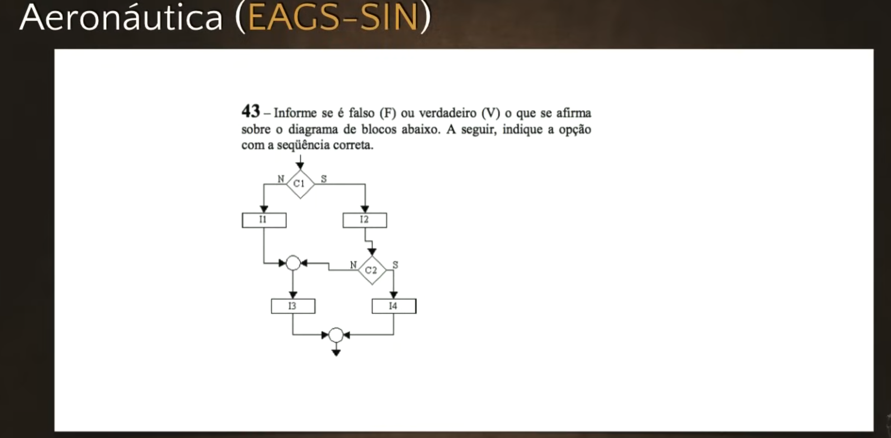

# Exercícios de Java #02 - Curso de Java para Iniciantes
**Professor:** Gustavo Guanabara | **Canal:** Curso em Vídeo

Este documento apresenta a transcrição, análise e resolução completa da segunda aula de exercícios do Curso de Java. Neste material, focaremos na resolução minuciosa de cinco questões retiradas diretamente de concursos militares (Marinha e Aeronáutica) e detalharemos a fundo a teoria sobre o processo de compilação abordada pelo professor.

---

## 1. O Processo de Compilação (Teoria Completa)
O professor dedica uma grande parte da aula para aprofundar um conceito cobrado frequentemente em concursos e vital para o entendimento da arquitetura de sistemas: **a diferença entre compilar e interpretar, e as etapas da compilação.**

### As Três Fases do Código
Um programa pode existir em três níveis:
1.  **Código Fonte (Simbólico / Alto Nível):** Aquele que nós digitamos (ex: comandos em C, Pascal, Java). É compreensível para os humanos, mas inútil nativamente para a máquina.
2.  **Código Relocável (Intermediário):** Resultado primário da compilação.
3.  **Código Objeto (Executável / Absoluto / Baixo Nível):** Instruções nativas em linguagem de máquina (binário) prontas para execução no hardware.

### Como Funciona a Compilação?
Muitos acham que "compilar" é apenas rodar o compilador e ter o executável. Na teoria técnica, o processo de compilação tradicional envolve dois utilitários:
*   **O Compilador:** Pega o código-fonte (alto nível) e o traduz para o **código relocável**. O compilador é responsável por verificar a sintaxe (ex: checar se faltou um ponto e vírgula ou se as variáveis têm o case correto). Uma única instrução de alto nível gera múltiplas instruções essenciais na linguagem relocável. Contudo, esse código *ainda não roda*, pois as variáveis e as instruções não têm um endereço real (físico) alocado na memória.
*   **O Montador (Assembler):** O montador não verifica erros de sintaxe (isso já foi feito). Ele pega o código relocável, calcula os endereços (realiza a alocação de memória) e gera o **código executável / código objeto**. Cada instrução do código relocável é convertida na proporção de "1 para 1" para linguagem de máquina.

### Como Funciona a Interpretação?
A interpretação é o atalho. O **Interpretador** não gera um arquivo executável intermediário armazenado no disco. Ele traduz e executa o código-fonte instrução por instrução diretamente para a máquina em tempo real.

### Trade-off (Compilador vs Interpretador)
*   **Compilador:** Demora mais no momento do pré-processamento (compilação total), mas a execução do programa final é **mais rápida**. O executável gerado requer **mais memória** para armazenar as instruções de uma vez.
*   **Interpretador:** A execução em tempo real é **mais lenta** (pois exige tradução instrução a instrução), porém consome **menos memória**, pois descarta a instrução carregada após executá-la.

*Nota sobre o Java:* O Java foge da regra tradicional, pois o `javac` compila o fonte não para código objeto nativo, mas para o intermediário **Bytecode**, que será rodado pela JVM (Máquina Virtual).

---

## 2. Resolução das Questões de Concurso

Aqui estão detalhadas as cinco perguntas exigidas pelo vídeo, acompanhadas da análise e resposta correta de cada uma delas.

### Questão 1 (Marinha) - Comandos e Arquivos do Java

**Pergunta:** Preencha as lacunas sobre o uso do Java SE Development Kit (JDK):
1. O comando do JDK que executa um aplicativo Java é \_\_\_\_\_\_\_\_.
2. O comando do JDK que compila um programa Java é \_\_\_\_\_\_\_\_.
3. Um arquivo de código-fonte Java deve terminar com a extensão \_\_\_\_\_\_\_\_.
4. Quando compilado, o arquivo produzido termina com a extensão \_\_\_\_\_\_\_\_.
5. O arquivo produzido pelo compilador Java contém \_\_\_\_\_\_\_\_ que são executadas pela JVM.

*   **Análise:** 
    * O comando que roda o programa pela JVM é apenas `java`. 
    * O compilador é o *Java Compiler*, ativado no terminal pelo comando `javac`. 
    * Os arquivos onde escrevemos código recebem a extensão `.java`. 
    * Após compilado pelo `javac`, o arquivo gerado recebe a extensão `.class`. 
    * O que existe dentro do arquivo `.class` para ser rodado pela JVM é o `bytecode`.
*   **Resposta Certa:** `java` / `javac` / `.java` / `.class` / `bytecode` (Alternativa A).

### Questão 2 (Aeronáutica) - Memória e Tempo na Compilação vs Interpretação

**Pergunta:** Indique Verdadeiro (V) ou Falso (F) para as sentenças:
1. ( ) A área de memória requerida para operar um programa compilado é menor do que a requerida para interpretação.
2. ( ) Um programa interpretado requer uma área de memória menor.
3. ( ) O tempo para execução interpretada é maior do que o tempo para execução compilada.
4. ( ) Um programa compilado requer um tempo de execução maior do que o programa interpretado.

*   **Análise:** Com base na nossa teoria acima, sabemos que compilação gera arquivos que ocupam *mais* memória, porém executam mais *rápido*. Já a interpretação gasta *menos* memória, mas é mais *lenta*. 
    * Item 1: Falso (programa compilado exige MAIS memória). 
    * Item 2: Verdadeiro. 
    * Item 3: Verdadeiro (interpretação é mais lenta). 
    * Item 4: Falso (programa compilado é mais rápido, tempo menor).
*   **Resposta Certa:** F, V, V, F (Alternativa A).

### Questão 3 (Concurso Militar) - Tradução Matemática para Lógica

**Pergunta:** Na construção de um algoritmo, como seria representado o cálculo da multiplicação da base pela altura, e em seguida a divisão pela constante dois (Área do Triângulo)?
*   **Análise:** Matematicamente, a área é: `(base * altura) / 2`. 
    * O operador matemático de multiplicação na programação é o asterisco (`*`).
    * O operador matemático de divisão na programação é a barra (`/`).
    * O símbolo de atribuição em fluxograma/pseudo-código é a seta de "recebe" (`<-`).
    * O código fica `Area <- (Base * Altura) / 2`. Os parênteses podem ser opcionais devido à mesma precedência dos operadores de multiplicação e divisão (resolvidos da esquerda para a direita).
*   **Resposta Certa:** `Area <- Base * Altura / 2` (Alternativa B).

### Questão 4 (Aeronáutica) - Média Aritmética e Precedência

**Pergunta:** Assinale a alternativa que contém a fórmula correta para calcular a média aritmética entre 4 notas representadas por N1, N2, N3 e N4.
*   **Análise:** O erro mais comum de iniciantes é escrever `N1 + N2 + N3 + N4 / 4`. Por conta da precedência dos operadores na matemática, a máquina vai executar a divisão primeiro, dividindo *apenas* a nota 4 por quatro, e depois somar com o restante. Para forçar a adição primeiro, é obrigatório delimitar toda a soma com parênteses.
*   **Resposta Certa:** `(N1 + N2 + N3 + N4) / 4` (Alternativa D).

### Questão 5 (Concurso Militar) - Fluxograma Condicional

**Pergunta:** Considere o Fluxograma apresentando `C1` e `C2` como Losangos (Condições / IF) e `I1, I2, I3, I4` como Retângulos (Instruções). Baseado no fluxo condicional aninhado mostrado no vídeo, avalie:
1. ( ) `I1` executa-se se `C1` for FALSO.
2. ( ) `I2` somente executa-se se `C2` for VERDADEIRO.
3. ( ) Se `C1` e `C2` forem FALSOS, o fluxo executa `I3`.
4. ( ) `I4` executa-se independente de `C1` e `C2`.

*   **Análise do Fluxograma do Vídeo:** 
    * O fluxo entra em `C1`. Se Falso (esquerda), executa `I3`. Se Verdadeiro (direita), executa `I1` e entra em `C2`.
    * No `C2`, se Falso (esquerda) ignora instruções (ou tem ramificação vazia). Se Verdadeiro (direita) executa `I4`. O bloco da primeira condição Verdadeira executa o `I2`.
    * Portanto, a afirmativa 1 diz que executa I1 se Falso. Errado, executa I3 se falso.
    * A afirmativa 2 diz que I2 só roda se C2 for Verdadeiro. Falso, I2 está preso ao fluxo do C1 ser Verdadeiro.
    * A afirmativa 3 diz que se ambos são falsos, roda I3. Correto, o primeiro falso já joga pro I3.
    * A afirmativa 4 diz que I4 é incondicional. Falso, ele está dentro do bloco verdadeiro do C2.
*   **Resposta Certa:** V, F, V, F (Alternativa C).

---

## Desempenho

**Meus Acertos:** `[ 5 / 5 ]`