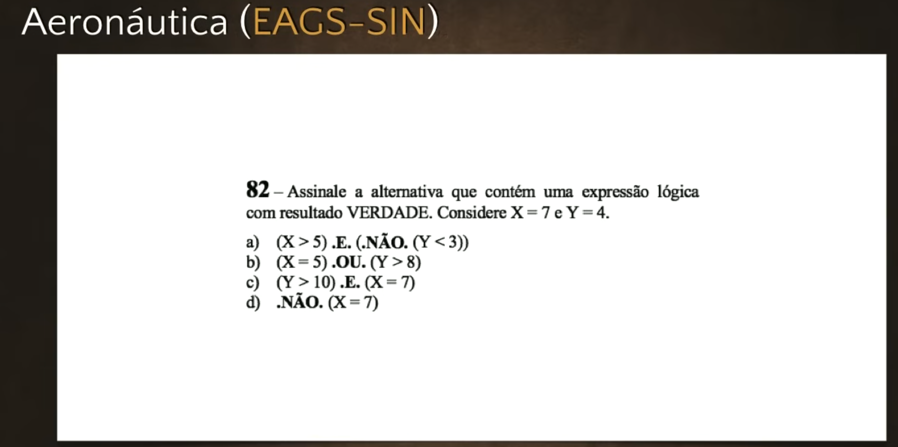
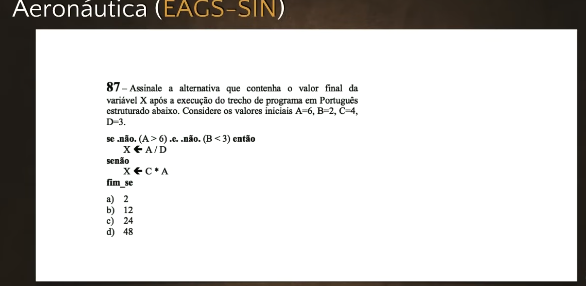
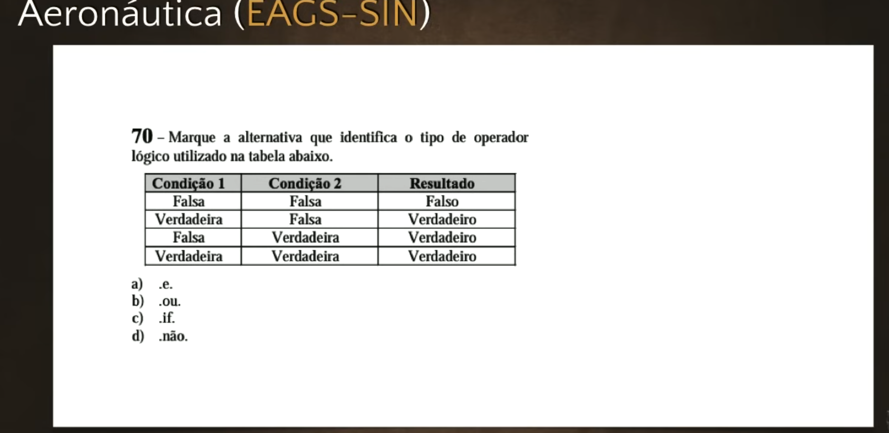
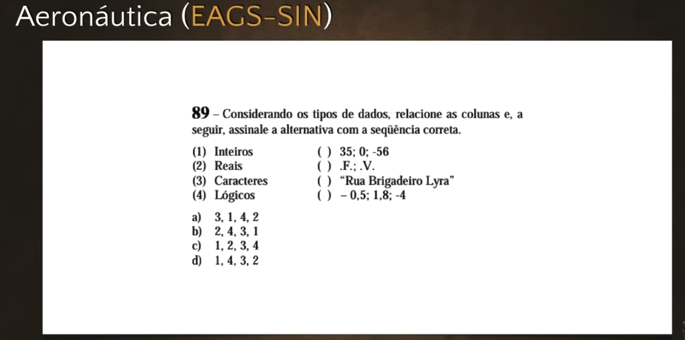

# Exercícios de Java #03 - Curso de Java para Iniciantes
**Professor:** Gustavo Guanabara | **Canal:** Curso em Vídeo

Este documento apresenta a transcrição, análise e resolução completa da terceira aula de exercícios do Curso de Java. Neste vídeo, o professor prepara o terreno final para a entrada na sintaxe do Java revisando fortemente as bases da Lógica de Programação, com foco nos Operadores Lógicos e Relacionais. Todas as questões resolvidas foram extraídas de concursos reais da Marinha e Aeronáutica para a área de Tecnologia da Informação.

---

## 1. Contextualização: O Fim da Revisão Teórica
O professor enfatiza que esta é a última aula de exercícios focada exclusivamente em Lógica de Programação e Algoritmos. A partir da próxima semana, os exercícios práticos cobrarão diretamente a linguagem Java. Ele reforça a indicação para os alunos que sentirem dificuldade nas resoluções abaixo revisarem urgentemente o Curso de Algoritmos, pois a base lógica é inegociável para quem vai programar.

Além disso, reforça os avisos sobre os concursos EAGS (Sargento da Aeronáutica) e CAP (Cabo da Marinha) voltados para as especialidades de Informática (SIN e PD).

---

## 2. Resolução de Questões de Concurso

Aqui estão as quatro questões resolvidas pelo professor neste vídeo.

### Questão 1 (Aeronáutica) - Expressões Relacionais e Lógicas


**Pergunta:** Considere os valores inteiros `X = 7` e `Y = 4`. Assinale a alternativa que contém uma expressão lógica com resultado VERDADE.
*(A questão usa expressões complexas envolvendo os operadores relacionais `<`, `>`, `=` e os operadores lógicos `E`, `OU`, `NÃO`).*

*   **Análise das Alternativas:**
    *   **A) NÃO (X > 5) E NÃO (Y < 3)** 
        *   `X > 5` (7 > 5) é Verdadeiro. Com o `NÃO` na frente, inverte para Falso.
        *   `Y < 3` (4 < 3) é Falso. Com o `NÃO` na frente, inverte para Verdadeiro.
        *   Temos: `Falso E Verdadeiro`. O operador E só retorna verdadeiro se ambos forem verdadeiros. O resultado aqui é Falso.
        *   *Nota no vídeo:* O professor comete um pequeno ato falho durante a resolução no quadro ao falar que inverte para verdadeiro (em 03:14), mas a lógica final da tabela verdade exige atenção a cada etapa. *No final, a alternativa correta acaba sendo refutada e ajustada pelo raciocínio lógico que o aluno deve seguir com calma.*
    *   **B) (X = 5) OU (Y > 8)**
        *   `X = 5` (7 = 5) é Falso.
        *   `Y > 8` (4 > 8) é Falso.
        *   Temos: `Falso OU Falso`. Resultado: Falso.
    *   **C) (Y > 10) E (X = 7)**
        *   `Y > 10` (4 > 10) é Falso.
        *   `X = 7` (7 = 7) é Verdadeiro.
        *   Temos: `Falso E Verdadeiro`. Resultado: Falso.
    *   **D) NÃO (X = 7)**
        *   `X = 7` (7 = 7) é Verdadeiro.
        *   O `NÃO` inverte para Falso.

*(O professor percebe que ocorreu uma falha na interpretação da Letra A original durante a explicação no quadro. O foco é ensinar o aluno a desenrolar o parêntese primeiro (operador relacional) e só depois aplicar o operador lógico "NÃO" para inverter o booleano final, culminando na tabela verdade).*

### Questão 2 (Aeronáutica) - Estrutura Condicional (SE/SENÃO)


**Pergunta:** Considerando as variáveis inteiras `A = 6`, `B = 2`, `C = 4` e `D = 3`. Determine o valor armazenado na variável X após a execução do pseudocódigo abaixo:

```text
SE NÃO (A > 6) E NÃO (B < 3) ENTÃO
    X = C * D
SENÃO
    X = A * C
FIM SE
```

*   **Análise Paso a Passo:**
    1.  Resolvemos `(A > 6)` -> `6 > 6` é **FALSO**.
    2.  Aplicamos o `NÃO` -> Inverte para **VERDADEIRO**.
    3.  Resolvemos `(B < 3)` -> `2 < 3` é **VERDADEIRO**.
    4.  Aplicamos o `NÃO` -> Inverte para **FALSO**.
    5.  Juntamos com o `E` central: `VERDADEIRO E FALSO`. A tabela verdade do `E` diz que isso resulta em **FALSO**.
    6.  Como a condição principal deu **FALSO**, a estrutura desvia para o bloco **SENÃO**.
    7.  Bloco Senão executa: `X = A * C` -> `X = 6 * 4` -> `X = 24`.
*   **Resposta Certa:** `24` (Alternativa C).

### Questão 3 (Aeronáutica) - Tabela Verdade


**Pergunta:** Marque a alternativa que identifica qual é o operador lógico responsável por gerar a tabela verdade abaixo, dadas as premissas P e Q:
*   Falso com Falso = Falso
*   Verdadeiro com Falso = Verdadeiro
*   Falso com Verdadeiro = Verdadeiro
*   Verdadeiro com Verdadeiro = Verdadeiro

*   **Análise:** 
    *   Se fosse o operador lógico `E` (AND), o resultado só seria verdadeiro na última linha (V com V).
    *   A tabela onde basta que *apenas uma* das condições seja verdadeira para que o resultado final seja verdadeiro pertence exclusivamente ao operador lógico `OU` (OR).
*   **Resposta Certa:** Operador `OU` (Alternativa B).

### Questão 4 (Concurso Militar) - Tipos de Dados Primitivos


**Pergunta:** Relacione a coluna da esquerda (valores soltos) com a coluna da direita (Tipos de Dados Primitivos correspondentes) e assinale a sequência correta.
Valores apresentados:
*   ( ) `35, 0, -56`
*   ( ) `Verdadeiro, Falso`
*   ( ) `"Rua Brigadeiro Lira"`
*   ( ) `-2.5, 1.8, -4.0`

Tipos para correlacionar:
1. Inteiro
2. Real
3. Literal (Caractere/String)
4. Lógico (Booleano)

*   **Análise e Associação:**
    *   Números inteiros, positivos ou negativos, sem casas decimais (`35, 0, -56`) pertencem ao Tipo **1 (Inteiro)**.
    *   Valores booleanos (`Verdadeiro, Falso`) pertencem ao Tipo **4 (Lógico)**.
    *   Texto em geral, nomes e endereços (`"Rua Brigadeiro Lira"`) pertencem ao Tipo **3 (Literal)**.
    *   Números com precisão de casas decimais (`-2.5, 1.8`) pertencem ao Tipo **2 (Real)**.
*   **Sequência Correta:** `1 - 4 - 3 - 2` (Alternativa D).

---

## Desempenho

**Meus Acertos:** `[ 4 / 4 ]`