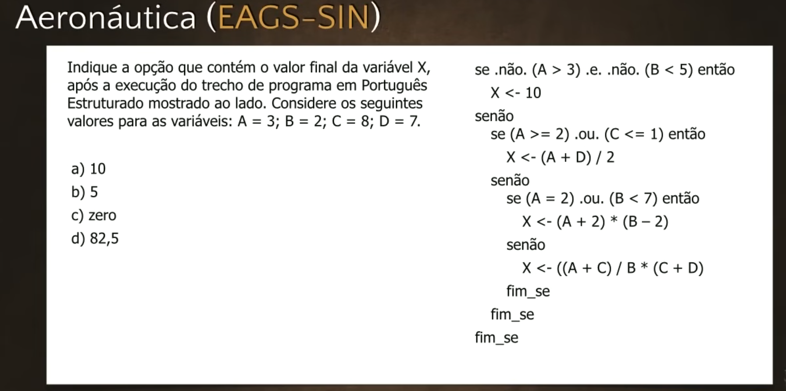
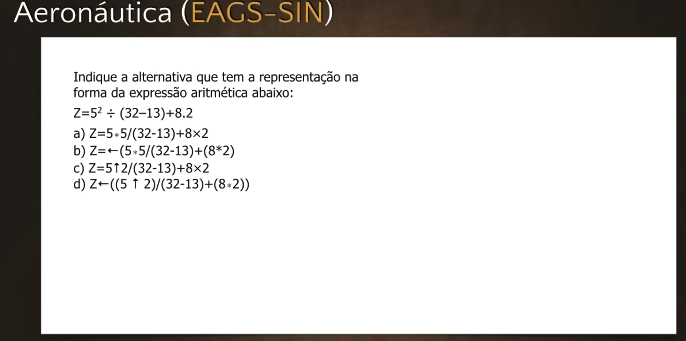
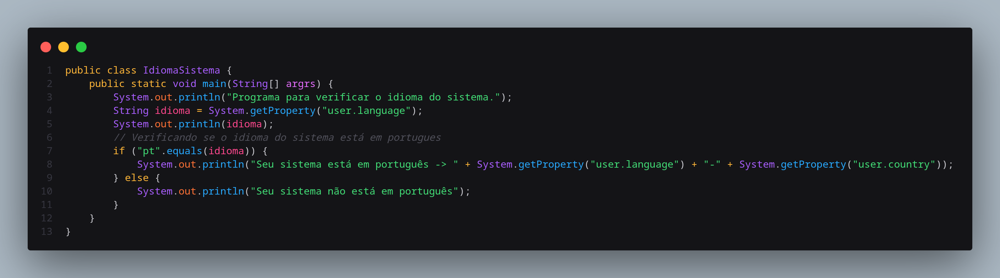
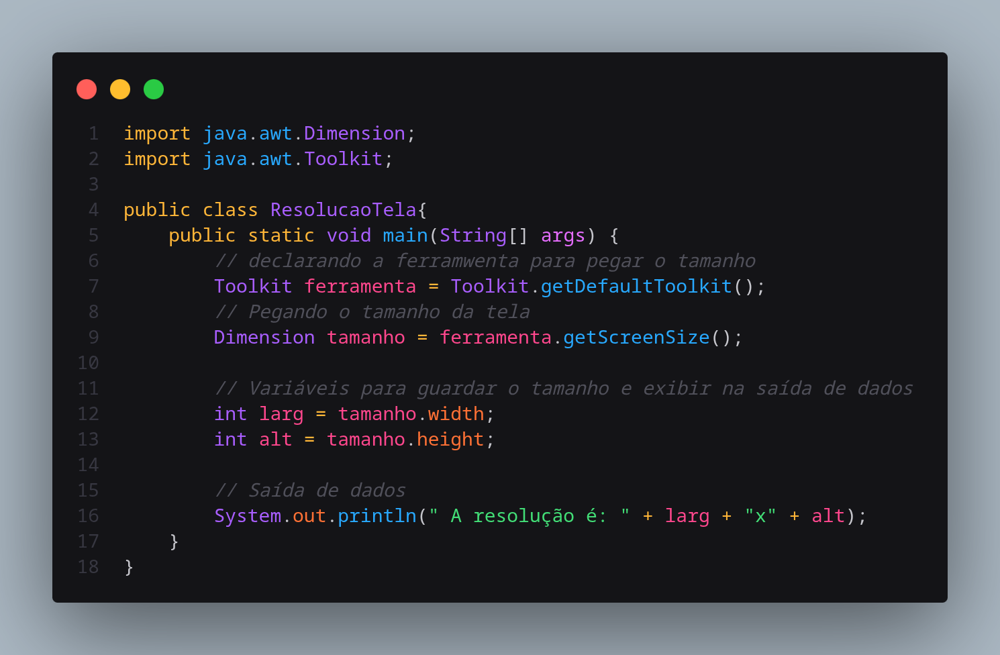

# Exercícios de Java #04 - Curso de Java para Iniciantes
**Professor:** Gustavo Guanabara | **Canal:** Curso em Vídeo

Chegamos à quarta aula de exercícios do curso! Este vídeo é o grande divisor de águas, pois, além de resolvermos os tradicionais exercícios de lógica de concursos militares (Marinha e Aeronáutica), finalmente temos a nossa **primeira prática de código real em Java** no NetBeans, complementando o "Olá, Mundo!" visto na aula teórica.

---

## 1. Resolução de Questões de Concurso

Antes de ir para a IDE, o professor faz a resolução de duas questões fundamentais de lógica de programação cobradas em concursos (EAGS e CAP).

### Questão 1: Teste de Mesa e Condicionais
**Pergunta:** Indique a opção que contém o valor final da variável `X` após a execução do trecho de código. 

Valores iniciais: `A = 3`, `B = 2`, `C = 8`, `D = 7`.
*   O algoritmo apresenta um bloco condicional `SE/SENÃO` testando múltiplas expressões relacionais (>, <, =, etc.) unidas por operadores lógicos (NÃO, E, OU).
*   **Análise Passo a Passo:**
    1.  O professor aconselha resolver *primeiro os operadores relacionais*, depois os *operadores lógicos NÃO (inversão)*, e só então o *E / OU*.
    2.  Na resolução das expressões, descobre-se que a primeira condição do `SE` resulta em **Falso**.
    3.  Como a primeira condição é Falsa, o algoritmo ignora o bloco principal (onde `X = 10`) e pula para o bloco **SENÃO**.
    4.  Dentro do SENÃO, existe outro `SE` cuja condição resulta em **Verdadeiro**.
    5.  A instrução a ser executada é: `X = (A + D) / 2`.
    6.  Substituindo os valores: `X = (3 + 7) / 2` ➔ `X = 10 / 2` ➔ `X = 5`.
*   **Resposta Certa:** `5` (Alternativa B).

### Questão 2: Expressões Aritméticas e Precedência
**Pergunta:** Indique a alternativa que representa corretamente em pseudocódigo a seguinte expressão matemática:

Matemática: `Z = [ 5² / (32 - 13) ] + 8,2`

*   **Análise:** 
    *   Potência de 5 ao quadrado é representada no algoritmo por `5 ^ 2` (ou `5 ** 2` dependendo da sintaxe base, no caso, o circunflexo ou seta para cima).
    *   A divisão `/` exige que o cálculo `32 - 13` seja isolado por parênteses para não violar a regra matemática de precedência.
    *   Tudo isso forma um grande bloco que será somado a `8.2`. Logo, engloba-se a primeira parte em parênteses também.
*   **Resposta Certa:** `Z <- ((5 ^ 2) / (32 - 13)) + 8.2` (Alternativa D).

---

## 2. A Prática no NetBeans fiz no VS Code: Hora do Sistema

Após a revisão de lógica, o professor abre o NetBeans para criar um programa útil: **Descobrir a data e hora atuais do sistema em que o Java está rodando.**

### Passo a Passo da Prática:
1.  Criar um Novo Projeto Java chamado `HoraDoSistema`.
2.  Dentro do método principal (`public static void main`), instanciar um objeto da classe `Date`.
    *   Código: `Date relogio = new Date();`
3.  **O pulo do gato (Importação):** Ao digitar `Date`, a IDE indicará um erro sublinhado em vermelho. Isso acontece porque a funcionalidade de data não vem carregada por padrão. É preciso clicar na lâmpada de sugestão ao lado da linha e selecionar: **Adicionar importação para java.util.Date**.
    *   Isso fará o código `import java.util.Date;` aparecer no topo do arquivo.
4.  Para escrever a mensagem, usa-se o atalho `sout` + TAB para gerar `System.out.println`.
5.  Em seguida, imprime-se o valor convertido para texto (String).
    *   Código: `System.out.println(relogio.toString());`
6.  Ao clicar no botão "Play" (Executar), o console exibirá a data, dia da semana, mês, hora exata e fuso horário capturados direto do sistema operacional!

---

## 3. O Desafio Prático

A aula termina com o Guanabara lançando um **desafio prático** para o aluno ir pesquisar e quebrar a cabeça em casa. Ele demonstra dois programinhas rodando, mas esconde o código-fonte:

1.  **Desafio 1 (Idioma do Sistema):** Criar um programa que identifique em qual idioma o sistema operacional está rodando (ex: `pt_BR`).
    *   *Dica implícita:* Pesquisar pelas classes `Locale` ou propriedades do `System`.

2.  **Desafio 2 (Resolução de Tela):** Criar um programa que descubra qual a resolução do monitor do usuário (ex: `1280 x 720`).
    *   *Dica implícita:* Pesquisar pela classe `Toolkit` do pacote `java.awt`.

O objetivo não é copiar código pronto, mas desenvolver a habilidade de ler documentação e buscar soluções em fóruns (uma rotina diária de qualquer programador sênior).

## Desempenho

**Meus Acertos:** `[ 5 / 5 ]`