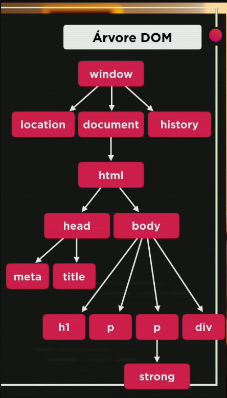

# Introdução ao DOM (Curso JavaScript #09)

Nesta aula, Gustavo Guanabara introduz o conceito de DOM (Document Object Model), explica a hierarquia da árvore de objetos de uma página web e ensina as diferentes formas de selecionar e manipular elementos HTML via JavaScript.

## 📌 Informações Gerais
- **Canal:** [Curso em Vídeo](https://www.youtube.com/@cursoemvideo)
- **Apresentador:** Gustavo Guanabara.
- **Link do Vídeo:** [Assista aqui](https://www.youtube.com/watch?v=WWZX8RWLxIk)

---

## 1. O que é o DOM?
**DOM (Document Object Model)** é um modelo de objetos para documentos. É uma interface que permite ao JavaScript acessar e modificar o conteúdo, a estrutura e o estilo de uma página web.
* O DOM não faz parte da linguagem JavaScript em si, mas sim do navegador.
* Quando o navegador carrega o HTML, ele cria uma árvore de objetos.

## 2. A Árvore DOM (Hierarquia)
A estrutura segue uma ordem de "pais" e "filhos" (*parents* e *children*):
* **window:** A raiz de tudo, representa a janela do navegador.
* **location:** Informações sobre a URL do site.
* **history:** Histórico de navegação.
* **document:** O documento HTML atual.
    * **html:** Filho do document.
        * **head:** Contém metadados e títulos.
        * **body:** Contém o conteúdo visual (h1, p, div, etc.).

        

## 3. Métodos de Seleção de Elementos
Existem cinco formas principais de selecionar elementos para manipulá-los:
* **Por Marca (`TagName`):** `getElementsByTagName()`. Retorna uma coleção (precisa usar índice, ex: `[0]`).
* **Por ID:** `getElementById()`. Seleciona um único elemento específico pelo seu ID.
* **Por Nome (`Name`):** `getElementsByName()`. Geralmente usado em campos de formulário.
* **Por Classe:** `getElementsByClassName()`. Seleciona elementos que compartilham a mesma classe CSS.
* **Por Seletor (CSS):** * `querySelector()`: Mais moderno e versátil. Usa sintaxe de CSS ( `#` para ID, `.` para classe).
    * `querySelectorAll()`: Seleciona todos os elementos que atendem ao seletor.

## 4. Manipulação Básica
Uma vez selecionado o elemento, podemos alterar suas propriedades:
* **`innerText`**: Altera apenas o texto interno (sem considerar tags HTML).
* **`innerHTML`**: Altera o conteúdo interno, interpretando tags HTML.
* **`style`**: Permite mudar o CSS do elemento (Ex: `elemento.style.color = 'red'`).

## 5. Dicas de Ferramentas
Para facilitar o desenvolvimento demonstrado na aula:
* **VS Code Extensions:** Recomendada a instalação do "Live Server" ou ferramentas de sincronização com o Chrome para ver as mudanças sem precisar atualizar a página manualmente.